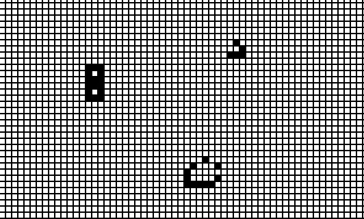

## Cellular Automata
**Cellular automata inspired by Conway's Game of Life**

A simple Cellular Automata in Python that is visualized using Pygame. When executed the grid is empty(blanck) and user selects (they change color to black) the cells in the desired pattern and presses any key when ready to run the cellular automata with the initially marked cells. Some results are displayed below:
<figure>
  
  <figcaption>Fig. 1: Gun automata <figcaption/>
<figure/>

<figure>
  
  <figcaption>Fig. 2: Spaceships and other patterns <figcaption/>
<figure/>

