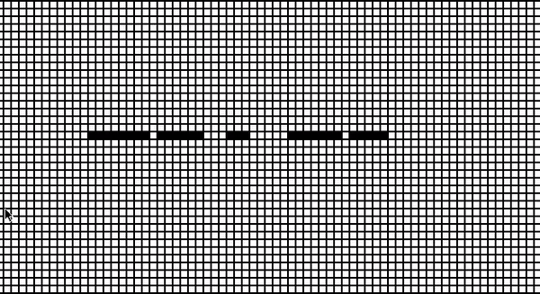
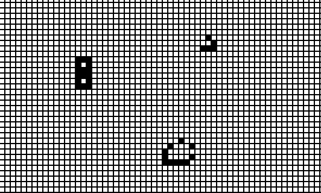
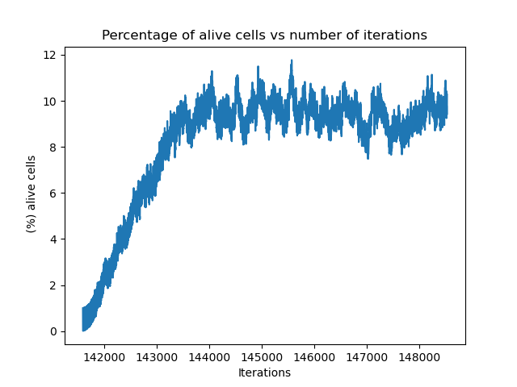

# Cellular Automata (Conway's Game of Life)
<p align="center">
  
<p/>
   
## About
Python implementation of a 2-dimensional cellular automata with the original rules of Conway's Game of life. The world is a grid where cells can be black or white.

The repository contains two main scripts:
* In `sandbox.py` the user can select by clicking on the cells which cells to initialize as alive and then to start the execution presses return/enter key. Then you can create patterns manually as displayed in the examples below (glider, guns, blinkers, ...)
* In `generations.py` the world starts empty, and then every some number of iterations lightining strikes, creating life in random postions of the world. Then rules are applied and this life evolves untill a new lightning strikes again. And this is repeated until user stops the execution. The purpose of this is to see how replicators and stable patterns appear and disappear from the initial empty world from the randomly revived cells from the lightning. Lightning allows the creation of patterns and destroys others by unstabilizing them. Upon letting the script for some time one can start recognizing some of the patterns (glider, blinkers, ...). Eventually the number of alive cells stabilizes, as can be seen by the plots when the program is terminated, if given sufficient time.

 The following rules specified the transitions:
```
-- Any live cell with fewer than two live neighbours dies, as if by underpopulation.
-- Any live cell with two or three live neighbours lives on to the next generation.
-- Any live cell with more than three live neighbours dies, as if by overpopulation.
-- Any dead cell with exactly three live neighbours becomes a live cell, as if by reproduction.
```
These rules, which compare the behavior of the automaton to real life, can be condensed into the following:
```
1.- Any live cell with two or three live neighbours survives.
2.- Any dead cell with three live neighbours becomes a live cell.
3.- All other live cells die in the next generation. Similarly, all other dead cells stay dead.
```
more info: https://en.wikipedia.org/wiki/Conway%27s_Game_of_Life

## Requirements
`pip install -r requirements.txt`

## Usage
* Install requirements `pip install -r requirements.txt`

for sandbox.py:
* Run sandbox program `python sandbox.py`
* Select cells to initialize as alive, when finished then press `enter/return key`
* To stop the execution of the program closs the window. Else the program will stop if no cells are alive.

for generations.py:
* Run main program `python generations.py --size=200 --spawn_freq=10`
* Then press `enter/return key` to start simulation
* To terminate simulation click exit, then plots of the evolution of alive cells will appear and will be saved.

## Examples (Sandbox)
<figure>
  
  <figcaption>Fig. 1: Gun automata <figcaption/>
<figure/>

<figure>
  
  <figcaption>Fig. 2: Spaceships and other patterns <figcaption/>
<figure/>

## Plots (generations.py)
<figure>
  
<figure/>
  
## Structure
```
|
---/files
--- sandbox.py
--- generations.py
```

